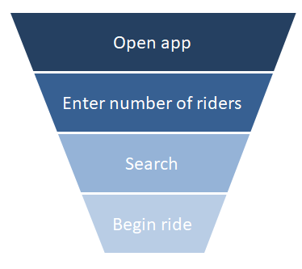
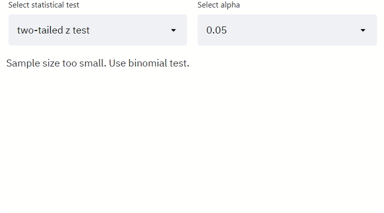

# A/B testing on app page changes 

This is a streamlit web app that allows users to determine whether the proposed changes favorably impacted selected metrics by detecting biased bucketing, selecting appropriate statistical tests, computing p-values and confidence intervals of the effect size, conducting sign tests on day-by-day breakdown data, and finding underperforming user segments.

## The data 
The data used in this demo app was modified from that in Udacity's 'Data Product Manager Nanodegree program'. It was event-level data from a multivariate test for the Flyber app that provides a flying-taxi service in one of the most congested cities in America -- New York City. 

The data looks something like below and recorded interactions with the app for ~80000 registered users.

We tested the booking page which is the last step in the user journal within the app and a critical part of the customer journey. It’s essential to test and experiment with the funnel to seek improvements that can raise conversion or improve the customer experience. The goal of the test was to see how people engage with the app booking page and which variations generated more bookings.

The user funnel looks like below:

We hypothesized that a redesign of the text on the booking button that would make it more personal and highlight the benefits of the experience would lead to more conversions. Another hypothesis was that removing the text 'tips included' on that page would simplify the page and make it easier for users to navigate. 

We tested 3 different versions of the app against the original and wanted to know which version of the app page would bring higher conversion probability. We chose conversion probability as it is a metric that can affect the high level business metric (e.g. revenue) and would likely be affected by the proposed changes.

Here are the original and experiment versions:

## Analyzing the result

### Sanity checks

The first step is to verify that the data has been collected correctly. This can be done by verifying whether the following metrics are comparable across the groups and time.
- number of users in each group
- number of events in each group
- number of cookies in each group
- click-through-probability from funnel step 1 to step 2

### Significance test on differences in conversion probability

We can use either t-test or z-test as approximations to the binomial distribution of conversion probability based on sample size.

### Analyzing user segments

Breaking down the data into different days of the week, differnt user segments etc. might give you new hypothesis about how people are reacting to your experiment.

Typical user segments include:
- By user acquisition date (cohort analysis). This refers to when the user starts using a product or a feature.
- By demographic similarities. Demographics are anything that describes a user as a person, such as income, age, and gender.
- By user's behavior when using a product or feature. This means the ways users use a product such as how often a product is visited or the device used.

### Sign test

Cross-checking the result with other methods such as sign test can tell us whether the trend of change we observed (increase or decrease) was evident in the daily data, further validate whether the change is consistent at which the control and treatment performed across days.
To conduct a sign test on the conversions, we first compute daily conversion probability for each group, then count how many days the conversion was higher in the treatment group than the control and this will be the number of successes for the statistical test to calculate the two tailed P-value.
We can choose from a binomial test, t-test or z-test depending on the sample size.

## How to use
- Clone or download this repo.
- Install required libraries to run the app:
`pip install -r requirements.txt`
- Go into the project directory and run the command:
`streamlit run demo_app.py`
- In the next few seconds, the app will open in a new tab in your default browser.

## Acknowledgement
The data was modified from Udacity's 'Data Product Manager Nanodegree program'.